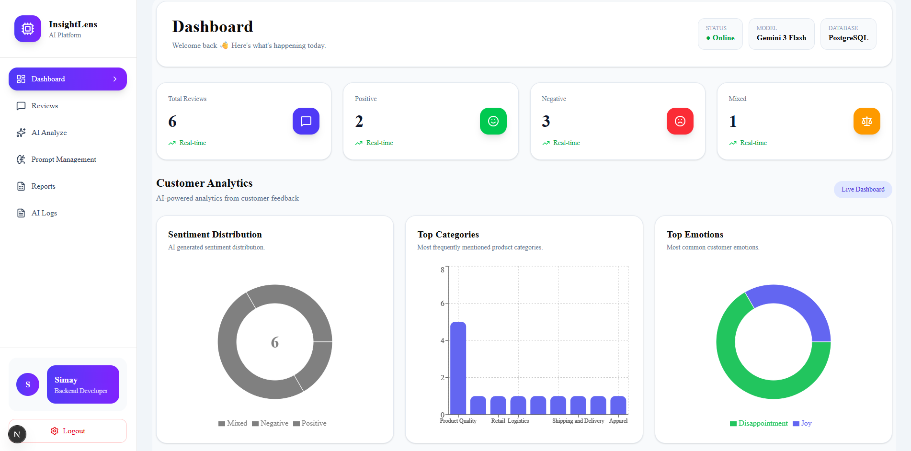
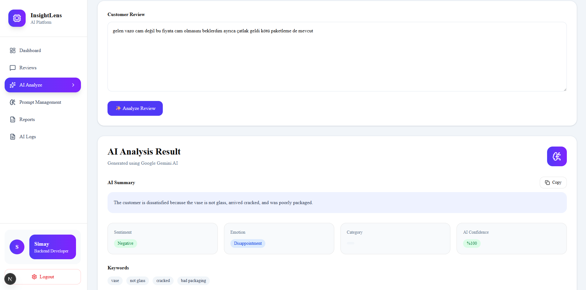
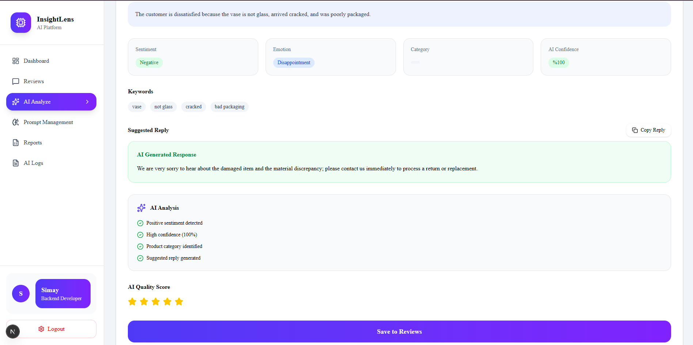
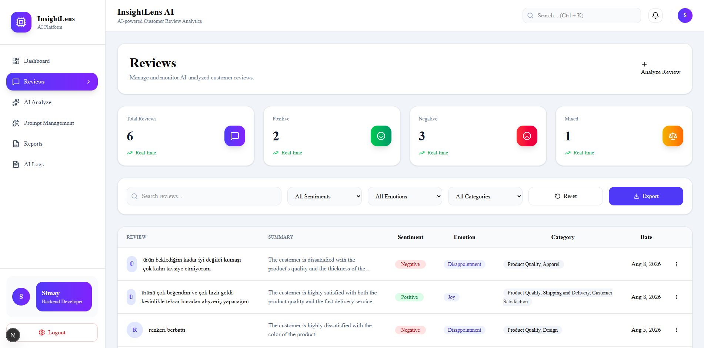
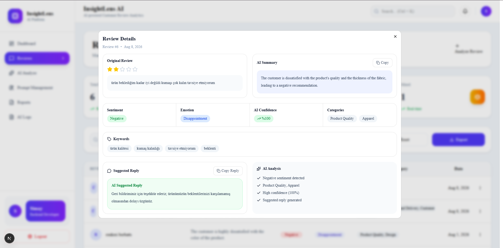
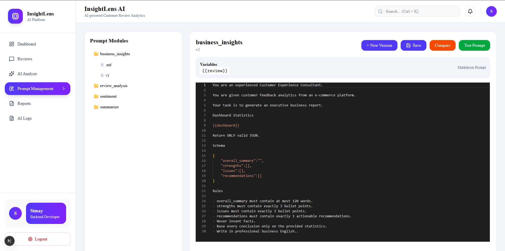
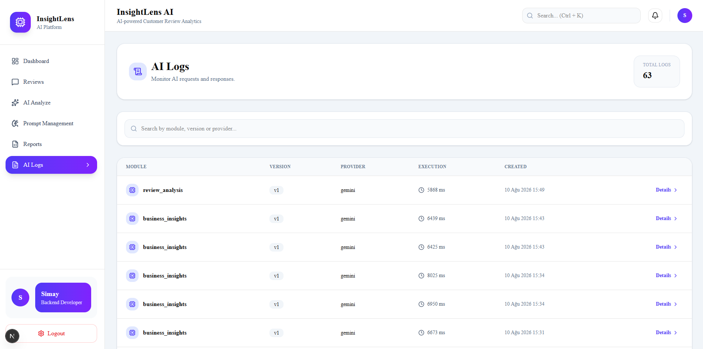
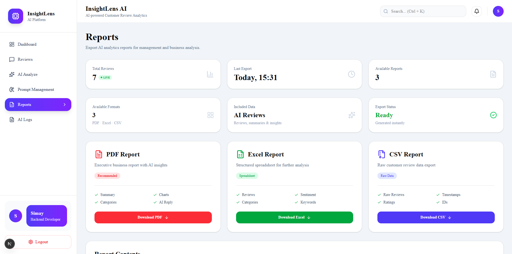

<div align="center">

# 🔍 InsightLens AI

**AI-powered customer review analytics platform built with FastAPI, Next.js, PostgreSQL, Docker and Google Gemini.**

InsightLens AI transforms unstructured customer feedback into structured, actionable business intelligence — combining LLM-powered review analysis, analytics, prompt versioning, AI execution logging, notifications and report generation in a single full-stack application.

[](LICENSE)


</div>

---

## 📋 Table of Contents

- [Demo](#-demo)
- [What InsightLens AI Does](#-what-insightlens-ai-does)
- [Key Features](#-key-features)
- [Architecture](#-architecture)
- [Tech Stack](#-tech-stack)
- [Project Structure](#-project-structure)
- [Authentication & Authorization](#-authentication--authorization)
- [API Modules](#-api-modules)
- [Example AI Response](#-example-ai-response)
- [Getting Started](#-getting-started)
- [Example Workflow](#-example-workflow)
- [Engineering Highlights](#-engineering-highlights)
- [Roadmap](#️-roadmap)
- [Author](#-author)
- [License](#-license)

---

## 🎥 Demo

> 🎬 **A full walkthrough video is coming soon** — it will demonstrate the complete application flow: analyzing customer feedback, storing AI results, visualizing analytics, generating business insights, managing prompts, monitoring AI executions and exporting reports. This section will be updated with the YouTube link once it's published.

### Dashboard



The dashboard provides a real-time overview of customer feedback with sentiment, category, emotion, review trends, recent reviews and AI-generated business insights.

---

## ✨ What InsightLens AI Does

A customer review can enter the system as plain text and be transformed into structured intelligence:

```text
Customer Review
      │
      ▼
AI Analysis
      │
      ├── Summary
      ├── Sentiment
      ├── Emotion
      ├── Categories
      ├── Keywords
      └── Suggested Reply
      │
      ▼
PostgreSQL
      │
      ├── Analytics
      ├── Dashboard
      ├── Business Insights
      ├── AI Logs
      └── Reports
```

> **Turn customer feedback into decisions, not just data.**

---

# 🚀 Key Features

## 🤖 AI-Powered Review Analysis

Google Gemini analyzes customer reviews and extracts:

- Summary
- Sentiment
- Emotion
- Product categories
- Keywords
- AI confidence
- Suggested customer reply

### AI Analysis



### AI Analysis Result



---

## 📊 Analytics Dashboard

The dashboard aggregates analyzed reviews into business-facing metrics.

- Total reviews
- Positive / Negative / Mixed sentiment
- Top categories
- Top emotions
- Review trends
- Recent AI-analyzed reviews
- AI-generated business insights


### AI Business Insights

Google Gemini converts collected analytics into an executive-level report containing:

- Executive Summary
- Strengths
- Issues
- Recommendations


---

## 💬 Review Management

Reviews can be searched, filtered and inspected through a dedicated review management interface.

Supported operations include:

- Search reviews
- Filter by sentiment
- Filter by emotion
- Filter by category
- View detailed AI analysis
- Re-analyze reviews
- Delete reviews
- Export review data



### Review Details



---

## 🧠 Prompt Management

Prompt templates are treated as application-level resources instead of being hard-coded into business logic.

The platform supports:

- Prompt modules
- Prompt versioning
- Prompt creation
- Prompt editing
- Prompt deletion
- Prompt testing
- Prompt comparison
- Dynamic prompt loading



This makes it possible to iterate on AI behavior without changing the core application code.

---

## 🧾 AI Execution Logs

The AI Logs interface provides visibility into AI executions.

Each log can contain:

- Module
- Prompt version
- Provider
- Execution time
- Created timestamp
- Prompt
- AI response



---

## 📑 Reporting

InsightLens AI supports exporting customer review data into:

- PDF
- Excel
- CSV



---

## 🔔 Notifications

The platform provides in-app notifications for important actions such as:

- AI analysis completion
- Business insight generation
- Prompt creation / update / deletion
- Report exports

Notifications are limited to the latest entries so the notification panel remains compact.

---

# 🏗 Architecture

InsightLens AI follows a layered backend architecture with clear separation between API, business logic, AI providers, repositories and persistence.

```text
┌──────────────────────────────────────────────┐
│                  Next.js                     │
│            Frontend / Dashboard              │
└──────────────────────┬───────────────────────┘
                       │ REST API
                       ▼
┌──────────────────────────────────────────────┐
│                   FastAPI                    │
│              API / Authentication            │
└──────────────────────┬───────────────────────┘
                       │
          ┌────────────┼────────────┐
          ▼            ▼            ▼
     Services       AI Layer    Repositories
          │            │            │
          │       Google Gemini     │
          │            │            │
          └────────────┼────────────┘
                       ▼
                  PostgreSQL
```

---

# 🛠 Tech Stack

| Layer | Technology |
|---|---|
| Frontend | Next.js, React, TypeScript |
| Styling | Tailwind CSS |
| Backend | FastAPI, Python |
| ORM | SQLAlchemy |
| Validation | Pydantic |
| Database | PostgreSQL |
| AI / LLM | Google Gemini |
| Authentication | JWT |
| Authorization | Role-Based Access Control |
| Password Hashing | bcrypt |
| Migrations | Alembic |
| HTTP Client | Axios |
| Containerization | Docker / Docker Compose |
| API Documentation | Swagger / OpenAPI |

---

# 📂 Project Structure

```text
InsightLens-AI/
│
├── backend/
│   ├── app/
│   │   ├── ai/
│   │   ├── api/
│   │   ├── clients/
│   │   ├── core/
│   │   ├── entities/
│   │   ├── loaders/
│   │   ├── mappers/
│   │   ├── middleware/
│   │   ├── prompts/
│   │   ├── repositories/
│   │   ├── reports/
│   │   ├── schemas/
│   │   ├── security/
│   │   ├── services/
│   │   └── utils/
│   │
│   ├── alembic/
│   ├── Dockerfile
│   ├── docker-compose.yml
│   └── requirements.txt
│
├── frontend/
│   ├── app/
│   ├── components/
│   ├── hooks/
│   ├── services/
│   └── ...
│
├── docs/
│   └── images/
│
├── .gitignore
└── README.md
```

---

# 🔐 Authentication & Authorization

The application uses JWT-based authentication.

```text
Register
   │
   ▼
Login
   │
   ▼
JWT Access Token
   │
   ▼
Protected API
   │
   ▼
Role-Based Authorization
```

Supported roles:

- `USER`
- `ADMIN`

Administrative operations such as prompt management and report exports are protected with role-based authorization.

---

# 🧩 API Modules

| Module | Base Endpoint | Purpose |
|---|---|---|
| Authentication | `/api/v1/auth` | Registration, login, current user |
| Reviews | `/api/v1/reviews` | Review analysis and management |
| Dashboard | `/api/v1/dashboard` | Dashboard metrics |
| Statistics | `/api/v1/statistics` | Review statistics |
| AI | `/api/v1/ai` | Summarization, sentiment, business insights |
| Prompt | `/api/v1/prompt` | Prompt CRUD, testing and versioning |
| Notifications | `/api/v1/notifications` | User notifications |
| AI Logs | `/api/v1/ai/logs` | AI execution monitoring |
| Reports | `/api/v1/reports` | PDF, Excel and CSV exports |

Full interactive API documentation is available via Swagger once the backend is running (see [Getting Started](#-getting-started)).

---

# 📄 Example AI Response

```json
{
  "summary": "The customer is satisfied with the product quality.",
  "sentiment": "Positive",
  "emotion": "Satisfaction",
  "categories": [
    "Product Quality"
  ],
  "keywords": [
    "quality",
    "excellent"
  ],
  "suggested_reply": "Thank you for your valuable feedback."
}
```

---

# ⚡ Getting Started

## Prerequisites

- [Docker](https://www.docker.com/) & Docker Compose
- [Node.js](https://nodejs.org/) 18+ (for running the frontend locally)
- [Python](https://www.python.org/) 3.11+ (only needed if running the backend outside Docker)
- A [Google Gemini API key](https://ai.google.dev/)

## 1. Clone the repository

```bash
git clone https://github.com/<your-username>/InsightLens-AI.git
cd InsightLens-AI
```

## 2. Configure backend environment variables

Create a `.env` file inside `backend/`:

```env
DATABASE_URL=your_postgresql_connection_string

JWT_SECRET_KEY=your_secret_key
JWT_ALGORITHM=HS256
ACCESS_TOKEN_EXPIRE_MINUTES=60

GEMINI_API_KEY=your_gemini_api_key
MODEL_NAME=gemini-3-flash-preview
```

> ⚠️ Never commit real API keys, passwords or production credentials.
>
> Generate a strong `JWT_SECRET_KEY` with:
> ```bash
> openssl rand -hex 32
> ```

## 3. Configure frontend environment variables

Create a `.env.local` file inside `frontend/`:

```env
NEXT_PUBLIC_API_URL=http://127.0.0.1:8000
```

## 4. Start the backend with Docker

```bash
cd backend
docker compose up --build
```

## 5. Run database migrations

With the containers running, apply migrations inside the backend container:

```bash
docker compose exec backend alembic upgrade head
```

## 6. Start the frontend

```bash
cd frontend
npm install
npm run dev
```

## 7. Open the application

| Service | URL |
|---|---|
| Frontend (Dashboard) | http://localhost:3000 |
| Backend API docs (Swagger) | http://127.0.0.1:8000/docs |

---

# 🧪 Example Workflow

```text
1. Login
   ↓
2. Submit customer review
   ↓
3. Gemini analyzes the review
   ↓
4. Structured AI result is returned
   ↓
5. Result is saved to PostgreSQL
   ↓
6. Dashboard statistics are updated
   ↓
7. AI execution is recorded in AI Logs
   ↓
8. Business Insights aggregates collected data
   ↓
9. Reports can be exported as PDF / Excel / CSV
```

---

# 📌 Engineering Highlights

### Backend Engineering

- Layered architecture
- Repository pattern
- Service layer
- FastAPI dependency injection
- SQLAlchemy ORM
- PostgreSQL persistence
- Alembic migrations
- JWT authentication
- Role-based authorization
- REST API design

### AI Engineering

- Google Gemini integration
- Structured AI responses
- Prompt templates
- Prompt versioning
- Prompt testing
- Prompt comparison
- AI execution logging
- Business insight generation

### Product Features

- Interactive analytics dashboard
- Review management
- AI analysis interface
- Notification system
- Reporting and exports
- AI monitoring interface

> **Note on testing:** this project does not yet have an automated test suite — it's tracked in the roadmap below. All flows shown in the demo video are manually verified.

---

# 🗺️ Roadmap

Potential future improvements:

- [ ] Redis caching
- [ ] Background AI processing
- [ ] RAG / knowledge-base integration
- [ ] Vector database integration
- [ ] Multi-LLM provider support
- [ ] Kubernetes deployment
- [ ] CI/CD pipeline
- [ ] Automated test coverage
- [ ] Prompt performance evaluation
- [ ] AI quality evaluation dashboard

---

# 👩‍💻 Author

**Simay Ayanoğlu**

Backend Developer · AI & LLM Applications

Built with ❤️ using **FastAPI, Next.js, PostgreSQL and Google Gemini.**

---

## ⭐ If you find this project useful

Consider giving the repository a ⭐.

This is a personal / portfolio project built to demonstrate full-stack and AI engineering skills. Feedback and suggestions are always welcome via Issues.

# 📜 License

This project is licensed under the MIT License.

See the [`LICENSE`](LICENSE) file for more information.