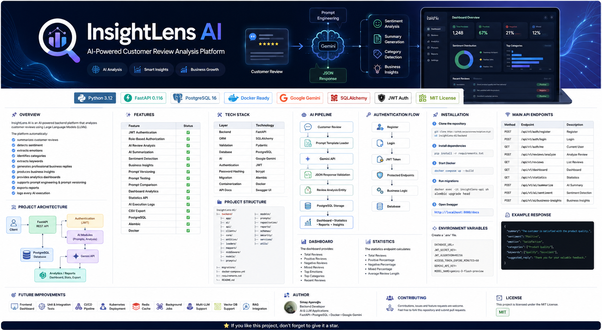
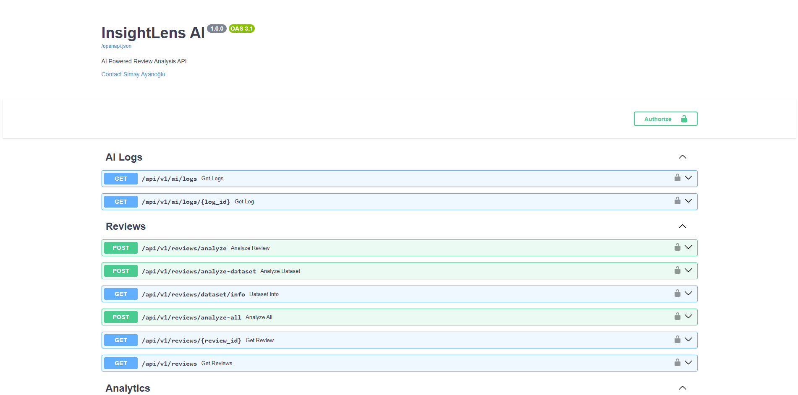
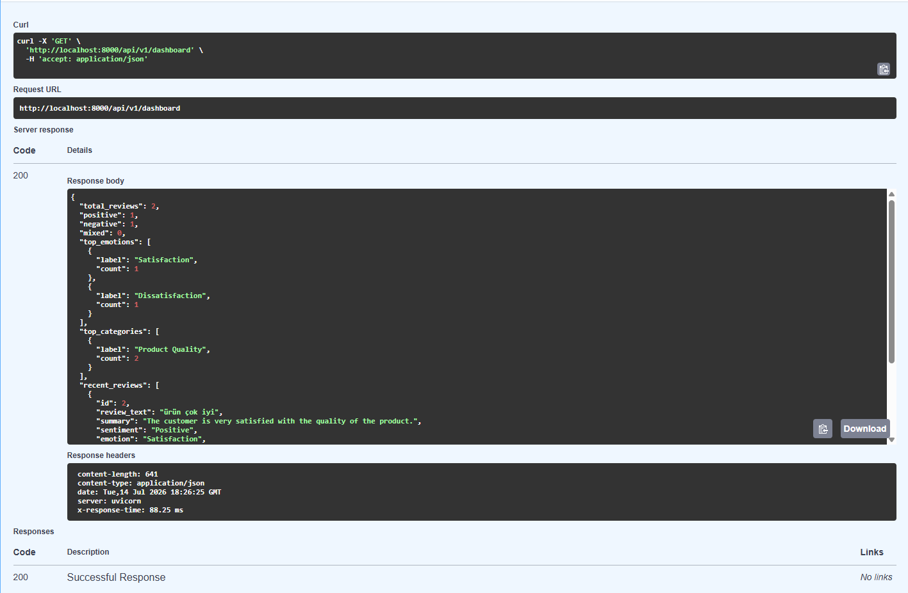
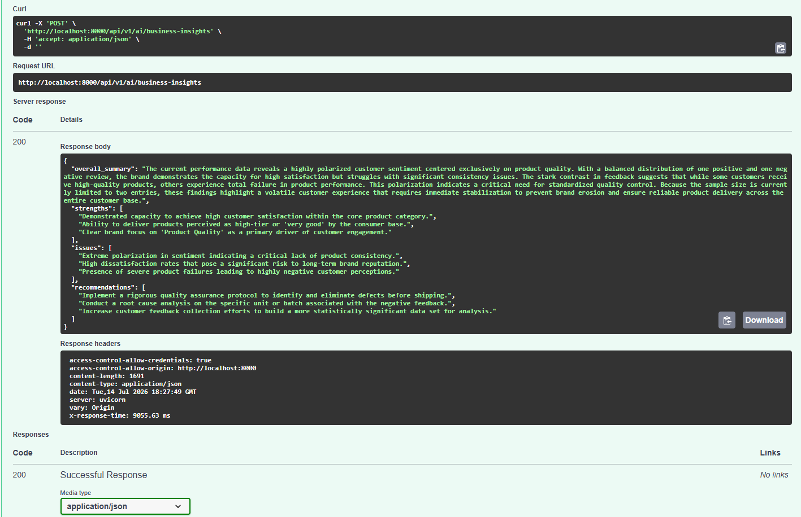
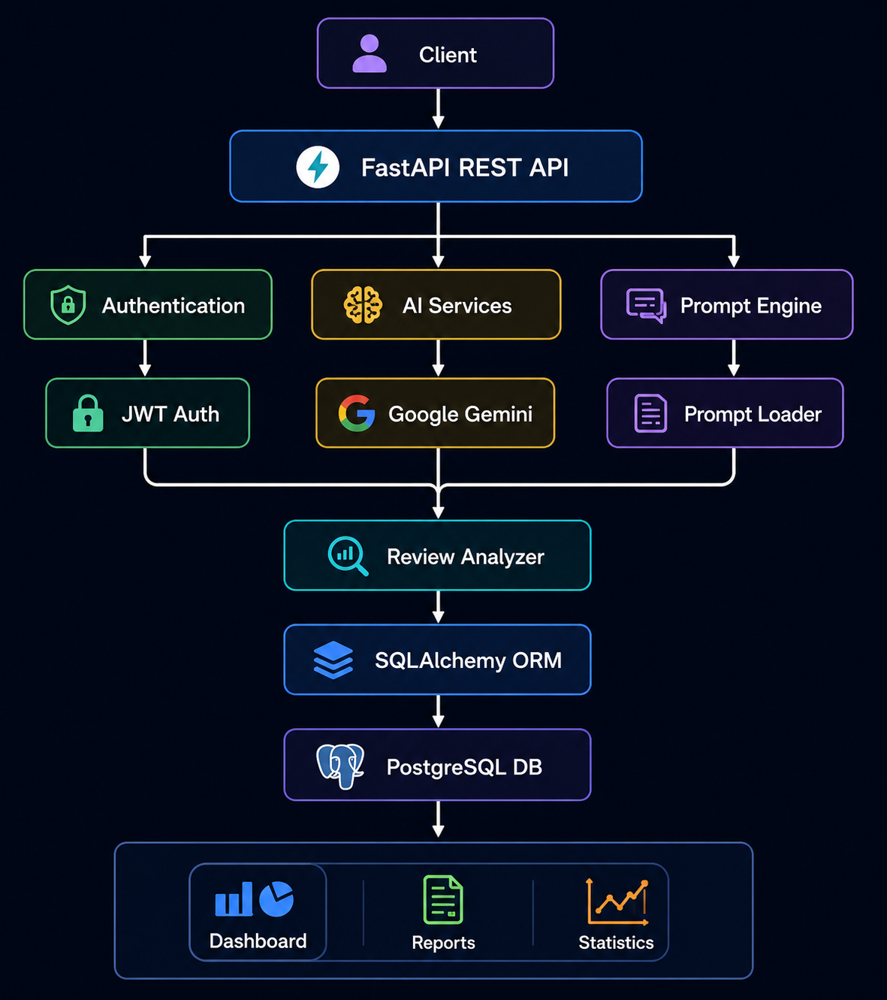

<p align="center">
  
</p>

# 🎥 Demo

<p align="center">





</p>

<p align="center">



</p>

---


# 🚀 InsightLens AI


> An AI-powered backend platform for intelligent customer review analysis using FastAPI, Google Gemini, PostgreSQL and Docker.

> It automatically analyzes customer feedback, generates business insights, manages prompt versions and exposes production-ready REST APIs.

---

# 📌 Overview

InsightLens AI is a production-ready AI-powered backend platform designed to analyze customer reviews using Large Language Models (LLMs).

The system automatically processes customer feedback, extracts meaningful insights, stores structured analysis results, and exposes them through REST APIs for dashboards, analytics, reporting, and business intelligence.

Core capabilities include:

- AI-powered review analysis
- Automatic summarization
- Sentiment detection
- Emotion extraction
- Category classification
- Keyword extraction
- Business insight generation
- Prompt version management
- Analytics dashboards
- AI execution logging
- Report generation

The project follows a layered architecture with clean separation of concerns and demonstrates modern backend engineering practices using FastAPI, PostgreSQL, Docker, SQLAlchemy, JWT Authentication and Google Gemini.

---

# ✨ Features

| Category           | Features                                                               |
|--------------------|------------------------------------------------------------------------|
| Authentication     | JWT Authentication, Role-Based Authorization                           |
| AI                 | Review Analysis, Summarization, Sentiment Detection, Business Insights |
| Prompt Engineering | Prompt CRUD, Prompt Testing, Prompt Comparison, Prompt Versioning      |
| Analytics          | Dashboard, Statistics, AI Logs                                         |
| Reporting          | CSV Export                                                             |
| Infrastructure     | Docker, PostgreSQL, Alembic                                            |

---

# 🛠 Tech Stack

| Layer             | Technology      |
|-------------------|-----------------|
| Backend           | FastAPI         |
| ORM               | SQLAlchemy      |
| Validation        | Pydantic        |
| Database          | PostgreSQL      |
| AI                | Google Gemini   |
| Authentication    | JWT             |
| Password Hashing  | bcrypt          |
| Migration         | Alembic         |
| Containerization  | Docker          |
| API Documentation | Swagger UI      |

---

# 🏗 Project Architecture

<p align="center">



</p>

The application follows a layered architecture where every request passes through authentication, service, AI, repository and persistence layers.

Prompt templates are loaded dynamically, executed by Google Gemini, validated, mapped into entities and stored in PostgreSQL before being exposed through analytics and reporting APIs.

---

# 📂 Project Structure

```text
InsightLens-AI
│
├── backend
│   ├── app
│   │   ├── ai
│   │   ├── api
│   │   ├── clients
│   │   ├── core
│   │   ├── entities
│   │   ├── loaders
│   │   ├── mappers
│   │   ├── middleware
│   │   ├── models
│   │   ├── prompts
│   │   ├── repositories
│   │   ├── reports
│   │   ├── schemas
│   │   ├── security
│   │   ├── services
│   │   └── utils
│   │
│   ├── migrations
│   ├── Dockerfile
│   ├── docker-compose.yml
│   ├── requirements.txt
│   └── README.md
│
└── docs
    └── images
```

---

# 🤖 AI Processing Pipeline

```text
Customer Review

        │

        ▼

Authentication

        │

        ▼

Review Service

        │

        ▼

Prompt Loader

        │

        ▼

Google Gemini API

        │

        ▼

JSON Validation

        │

        ▼

Entity Mapping

        │

        ▼

PostgreSQL Database

        │

        ▼

Dashboard
│
├── Statistics
├── Reports
└── Business Insights
```

---

# 🔑 Authentication Flow

```
Register

↓

Login

↓

JWT Token

↓

Protected Endpoints

↓

Business Logic

↓

Database
```

---

# 📊 Dashboard

The Dashboard module provides a real-time overview of analyzed customer reviews.

It aggregates AI-generated review data and exposes REST endpoints for monitoring customer satisfaction trends.

Available metrics include:

- Total Reviews
- Positive Reviews
- Negative Reviews
- Mixed Reviews
- Top Emotions
- Top Categories
- Recent Reviews

---

# 📈 Statistics

The statistics endpoint calculates:

- Total Reviews
- Positive Percentage
- Negative Percentage
- Mixed Percentage
- Average Review Length

---

# 💬 Prompt Management

Prompt management system supports

- Prompt Versioning

- Prompt Testing

- Prompt Comparison

- Prompt CRUD

without changing application code.

---

# 🤖 Business Insights

Business Insights analyzes all collected reviews and generates

- Executive Summary

- Strengths

- Issues

- Recommendations

using Google Gemini.

---

# 🔐 Authentication

Authentication uses

- JWT Access Tokens

- HTTP Bearer Authentication

- Role Based Authorization

Roles

- USER
- ADMIN

---

# 🚀 Installation

## Clone Repository

```bash
git clone https://github.com/<your-username>/InsightLens-AI.git

cd InsightLens-AI/backend
```

## Configure Environment

Create a `.env` file.

```env
DATABASE_URL=

JWT_SECRET_KEY=

JWT_ALGORITHM=HS256

ACCESS_TOKEN_EXPIRE_MINUTES=60

GEMINI_API_KEY=

MODEL_NAME=gemini-3-flash-preview
```

## Build Containers

```bash
docker compose up --build
```

## Run Database Migrations

```bash
docker exec -it insightlens-api sh

alembic upgrade head
```

## Open API Documentation

```
http://127.0.0.1:8000/docs
```

---


# 📡 API Modules

| Module | Endpoint | Description |
|---------|----------|-------------|
| Authentication | `/api/v1/auth` | Register, Login, Current User |
| Reviews | `/api/v1/reviews` | Analyze, List, Detail |
| Dashboard | `/api/v1/dashboard` | Dashboard Metrics |
| Statistics | `/api/v1/statistics` | Review Statistics |
| AI | `/api/v1/ai` | Summarization, Sentiment, Business Insights |
| Prompt | `/api/v1/prompt` | Prompt CRUD & Versioning |

---

# 📄 Example Response

Example response returned by the Review Analysis endpoint.

```json
{
  "summary": "The customer is satisfied with the product quality.",
  "sentiment": "Positive",
  "emotion": "Satisfaction",
  "categories": [
    "Product Quality"
  ],
  "keywords": [
    "quality",
    "excellent"
  ],
  "suggested_reply": "Thank you for your valuable feedback."
}
```

---

# 🚀 Roadmap

- Frontend Dashboard (React)
- Redis Cache
- Background Tasks (Celery)
- Retrieval-Augmented Generation (RAG)
- Vector Database Integration
- Multi-LLM Support
- Kubernetes Deployment
- CI/CD Pipeline
- Automated Testing
- Prompt Performance Metrics
- AI Evaluation Module

---

# 💡 Highlights

✔ Production-Ready REST API

✔ Layered Architecture

✔ Repository Pattern

✔ Prompt Engineering

✔ Prompt Versioning

✔ Google Gemini Integration

✔ JWT Authentication

✔ Dockerized Deployment

✔ Dashboard Analytics

✔ Business Intelligence

✔ AI Execution Logging

✔ Report Generation

---

# 👨‍💻 Author

**Simay Ayanoğlu**

Backend Developer

AI & LLM Applications

---

# ⭐ If you like this project, don't forget to give it a star.


# 📜 License

This project is licensed under the MIT License.

See the LICENSE file for more information.

---

Made with ❤️ using FastAPI, Google Gemini and PostgreSQL.